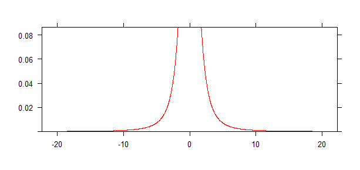

# Praktikum Probstat Modul 2

## Identitas

| Nama          | NRP           | Kelas |
| ---           | ---           | ---   |
| Nadif Mustafa | 5025211127    | C     |

## Daftar Isi

- [Praktikum Probstat Modul 2](#praktikum-probstat-modul-2)
  - [Identitas](#identitas)
  - [Daftar Isi](#daftar-isi)
  - [Soal 1](#soal-1)
    - [1A](#1a)
    - [1B](#1b)
    - [1C](#1c)
  - [Soal 2](#soal-2)
    - [2A](#2a)
    - [2C](#2c)
  - [Soal 3](#soal-3)
    - [3A](#3a)
    - [3B](#3b)
    - [3C](#3c)
    - [3D](#3d)
    - [3E](#3e)
    - [3F](#3f)
  - [Soal 4](#soal-4)

## Soal 1

Seorang peneliti melakukan penelitian mengenai pengaruh aktivitas *A* terhadap kadar saturasi oksigen pada manusia. Peneliti tersebut mengambil sampel sebanyak 9 responden. Pertama, sebelum melakukan aktivitas *A*, peneliti mencatat kadar saturasi oksigen dari 9 responden tersebut. Kemudian, 9 responden tersebut diminta melakukan aktivitas *A*. Setelah 15 menit, peneliti tersebut mencatat kembali kadar saturasi oksigen dari 9 responden tersebut. Berikut data dari 9 responden mengenai kadar saturasi oksigen sebelum dan sesuah melakukan aktivitas.

| **Responden** | **X**         | **Y**         |
| ---           | ---           | ---           |
| <center> 1    | <center> 78   | <center> 100  |
| <center> 2    | <center> 75   | <center> 95   |
| <center> 3    | <center> 67   | <center> 70   |
| <center> 4    | <center> 77   | <center> 90   |
| <center> 5    | <center> 70   | <center> 90   |
| <center> 6    | <center> 72   | <center> 90   |
| <center> 7    | <center> 78   | <center> 89   |
| <center> 8    | <center> 70   | <center> 100  |
| <center> 9    | <center> 77   | <center> 100  |

Berdasarkan data pada tabel di atas, diketahui kadar saturasi oksigen dari responden ke-3 ketika belum melakukan aktivitas *A* sebanyak 67, dan setelah melakukan aktivitas *A* sebanyak 70.

### 1A

> **Carilah Standar Deviasi dari data selisih pasangan pengamatan tabel di atas**

Berikut adalah script R untuk soal 1A :

```R
install.packages("BSDA")
library(BSDA)

# A
# Standar Deviasi dari data selisih pasangan pengamatan

x <- c(78, 75, 67, 77, 70, 72, 78, 70, 77)
y <- c(100, 95, 70, 90, 90, 90, 89, 100, 100)

diff <- y - x
sd(diff)
```

- `x :` kadar saturasi oksigen responden sebelum melakukan aktivitas *A*
- `y :` kadar saturasi oksigen responden setelah melakukan aktivitas *A*
- `diff :` selisih data saturasi oksigen sebelum dan sesudah melakukan aktivitas *A*
- `sd() :` function untuk mencari standar deviasi dari selisih

<br>

Berikut adalah hasilnya :

```
> sd(diff)
[1] 7.838651
```

### 1B

> **Carilah nilai t (p-value)**

Berikut adalah script R untuk soal 1A :

```R
# B
# Nilai t (p-value)

t.test(x, y, paired=TRUE)
```

- `t.test() :` function untuk melakukan uji t-test.
- `paired=TRUE :` salah satu argumen dari function `t.test()` untuk menandakan bahwa dilakukan uji t berpasangan.

<br>

Berikut adalah hasilnya :

```bash
> t.test(x, y, paired=TRUE)

	Paired t-test

data:  x and y
t = -6.8039, df = 8, p-value = 0.0001373
alternative hypothesis: true mean difference is not equal to 0
95 percent confidence interval:
 -23.80310 -11.75246
sample estimates:
mean difference 
      -17.77778
```

### 1C

> **Tentukanlah apakah terdapat pengaruh yang signifikan secara statistika dalam hal kadar saturasi oksigen, sebelum dan sesudah melakukan aktivitas *A* jika diketahui tingkat signifikansi &alpha; = 5% serta H0 : "tidak ada pengaruh yang signifikan secara statistika dalam hal kadar saturasi oksigen sebelum dan sesudah melakukan aktivitas *A*".**

Setelah dilakukan uji t, didapatkan nilai p-value.

Nilai p-value bisa digunakan untuk menentukan apakah terdapat pengaruh signifikan pada kadar saturasi oksigen antara sebelum dan sesudah melakukan aktivitas *A*. Apabila nilai p-value kurang dari tingkat signifikansi (&alpha; = 5%), maka kita dapat menolak H0 (tidak ada pengaruh signifikan).

Dikarenakan nilai p-value yang didapatkan setelah uji t adalah `0.0001373` (kurang dari &alpha; = 0.05), maka kita dapat menolak H0. Sehingga dapat disimpulkan bahwa **terdapat pengaruh signifikan secara statistika dalam hal kadar saturasi oksigen, sebelum dan sesudah melakukan aktivitas *A*.**

## Soal 2

Diketahui bahwa mobil dikemudikan rata-rata lebih dari 25.000 kilometer per tahun. Untuk menguji klaim ini, 100 pemilik mobil dipilih secara acak diminta untuk mencatat jarak yang mereka tempuh. Jika sampel acak menunjukkan rata-rata 23.500 kilometer dan standar deviasi 3.000 kilometer (kerjakan menggunakan library seperti referensi pada modul).

### 2A

> **Apakah Anda setuju dengan klaim tersebut? Jelaskan.**

Saya setuju, karena sebelum melakukan uji z-sum kita dibolehkan untuk memberikan klaim bahwa mungkin saja apabila mobil dikemudikan rata-rata lebih dari 25.000 kilometer per tahun.

Kemudian, untuk menguji bahwa klaim kita benar bisa menggunakan uji z-sum.

### 2C

> **Buatlah kesimpulan berdasarkan p-value yang dihasilkan!**

Berikut adalah Script R untuk melakukan uji z-sum :

```R
# C
# Kesimpulan berdasarkan p-value yang dihasilkan

rerata = 23500
sigma  = 3000
n      = 100

zsum.test(rerata, sigma, n,
          alternative = "greater",
          mu = 25000)
```

- `rerata :` rata-rata data pada sampel acak
- `sigma :` standar deviasi pada sampel acak
- `n :` banyak sampel acak yang diuji
- `zsum.test() :` function untuk melakukan uji z-sum
- `mu :` nilai klaim rata-rata

<br>

Berikut adalah hasilnya :

```bash
> zsum.test(rerata, sigma, n,
+           alternative = "greater",
+           mu = 25000)

    One-sample z-Test

data:  Summarized x
z = -5, p-value = 1
alternative hypothesis: true mean is greater than 25000
95 percent confidence interval:
 23006.54       NA
sample estimates:
mean of x 
    23500
```

Berdasarkan hasil di atas, didapatkan nilai p-value adalah 1 (lebih besar dari &alpha; = 0.05), maka tidak cukup bukti untuk menolak H0. Sehingga dapat disimpulkan bahwa **rata-rata jarak tempuh mobil lebih dari 25.000 kilometer per tahun.**

## Soal 3

Diketahui perusahaan memiliki seorang *data analyst* yang ingin memecahkan permasalahan pengambilan keputusan dalam perusahaan tersebut. Selanjutnya didapatkanlah data berikut dari perusahaan saham tersebut.

| **Nama Kota/Atribut**     | **Bandung**   | **Bali**  |
| ---                       | ---           | ---       |
| **Jumlah Saham**          | 20            | 27        |
| **Sampel Mean**           | 3.64          | 2.79      |
| **Sampel Standar Deviasi**| 1.67          | 1.5       |

Dari data di atas berilah keputusan serta kesimpulan yang didapatkan. Asumsikan nilai variancenya sama, apakah ada perbedaan pada rata-ratanya (&alpha; = 0.05)?

### 3A

> **Buatlah H0 dan H1**

- `H0 :` rata-rata data saham pada Bandung dan Bali sama.
- `H1 :` rata-rata data saham pada Bandung dan Bali tidak sama.

### 3B

> **Hitung sampel statistik**

Berikut adalah Script R untuk soal 3B :

```R
# B
# Sampel Statistik

n1      = 20
rerata1 = 3.64
sd1     = 1.67

n2      = 27
rerata2 = 2.79
sd2     = 1.5

tsum.test(rerata1, sd1, n1,
          rerata2, sd2, n2,
          alternative = "greater",
          var.equal = TRUE)
```

- `n1 :` jumlah saham di Bandung
- `rerata1 :` sampeal mean di Bandung
- `sd1 :` sampel standar deviasi di Bandung
- `n2 :` jumlah saham di Bali
- `rerata2 :` sampel mean di Bali
- `sd2 :` sampel standar deviasi di Bali
- `tsum.test() :` function untuk melakukan uji t-test yang menghasilkan nilai t-statistik, p-value, dan interval kepercayaan.
- `alternative = "greater" :` argumen pada function `tsum.test()` untuk menandakan bahwa hipotesis alternatif adalah rata-rata kelompok pertama lebih besar dari rata-rata kelompok kedua.
- `var.equal = TRUE :` argumen pada function `tsum.test()` untuk menandakan bahwa asumsi adalah nilai variance dari 2 kelompok adalah sama.

<br>

Berikut adalah hasilnya :

```bash
> tsum.test(rerata1, sd1, n1,
+           rerata2, sd2, n2,
+           alternative = "greater",
+           var.equal = TRUE)

    Standard Two-Sample t-Test

data:  Summarized x and y
t = 1.8304, df = 45, p-value = 0.03691
alternative hypothesis: true difference in means is greater than 0
95 percent confidence interval:
 0.07012818         NA
sample estimates:
mean of x mean of y 
     3.64      2.79
```

### 3C

Berikut adalah Script R untuk soal 3C :

```R
install.packages("mosaic")
library(mosaic)

# C
# Uji statistik (df = 2)

plotDist(dist = 't', df = 2, col = "red")
```

- `dist :` jenis distribusi (t-student)
- `df :` derajat kebebasan (2)
- `col :` warna garis plot (merah)

Distribusi t-student digunakan dalam uji t-test ketika ukuran sampel relatif kecil atau variansi populasi tidak diketahui. Melalui plot distribusi, kita dapat mengetahui nilai t-statistik dan p-value dari distribusi t-student untuk derajat kebebasan yang diberikan.

<br>

Berikut adalah hasilnya :



### 3D

> **Nilai Kritikal**

Berikut adalah Script R untuk soal 3D :

```R
# D
# Nilai Kritikal

qchisq(p = 0.05, df = 2, lower.tail = FALSE)
```

- `p :` tingkat signifikansi (&alpha; = 0.05)
- `df :` derajat kebebasan (2)
- `qchisq() :` function untuk menghitung nilai kritikal dari distribusi chi-square
- `lower.tail = FALSE :` argumen pada function `qchisq()` untuk menandakan bahwa kita ingin mencari nilai kritikal pada ekor atas distribusi chi-square.

<br>

Berikut adalah hasilnya :

```bash
> qchisq(p = 0.05, df = 2, lower.tail = FALSE)
[1] 5.991465
```

s

### 3E

> **Keputusan**

Pada soal 3B didapatkan nilai p-value sebesar 0.03691 (lebih kecil dari nilai signifikan &alpha; = 0.05), maka H0 dapat ditolak dan H1 diterima.

### 3F

> **Kesimpulan**

Karena nilai p-value lebih kecil dari nilai signifikan yang menyebabkan H0 ditolak dan H1 diterima, maka dapat ditarik kesimpulan bahwa **nilai rata-rata saham dari Bandung dan Bali tidak sama.**

## Soal 4

